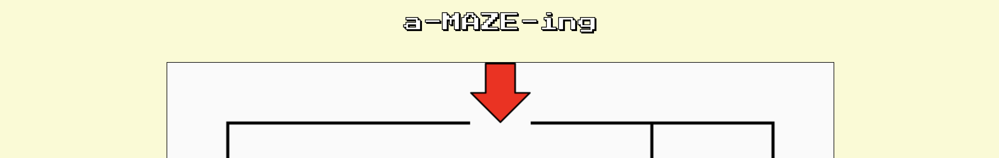

# a-MAZE-ing

## The Project
a-MAZE-ing is a game-like experience built using vanilla JS, HTML and CSS.
The goal is to have players understand computer logic by navigating the maze using only two commands, __forward__ and __rotate__.
